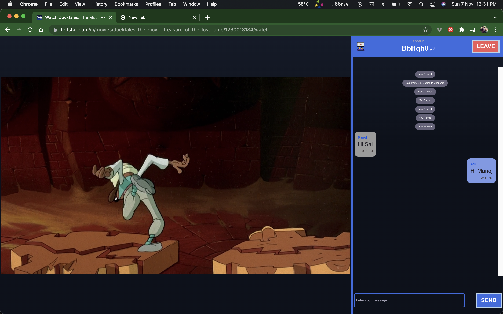
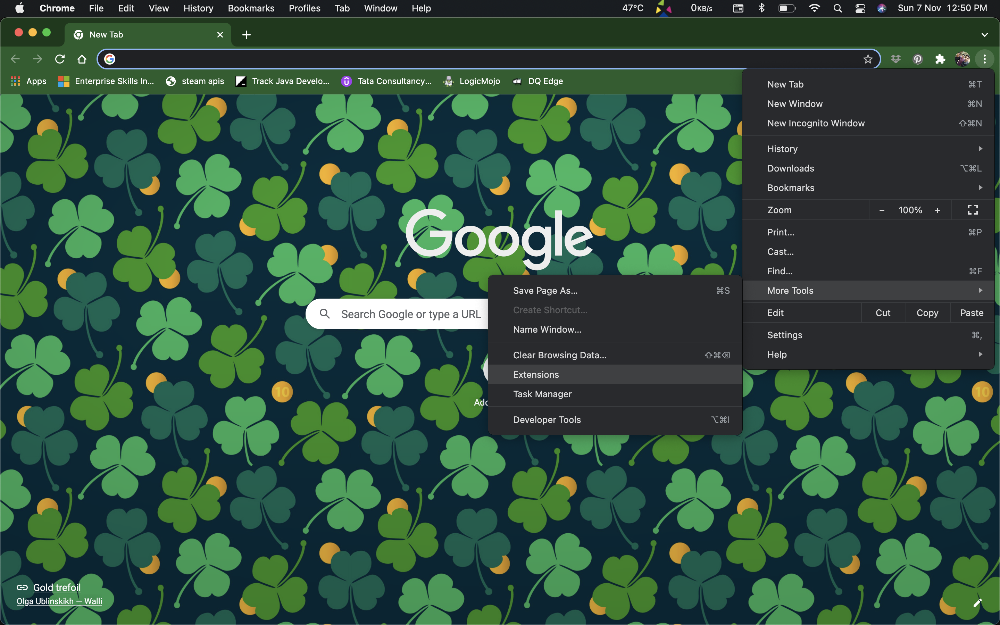
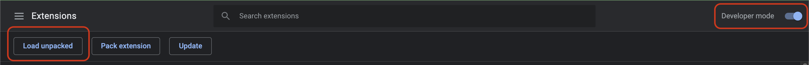
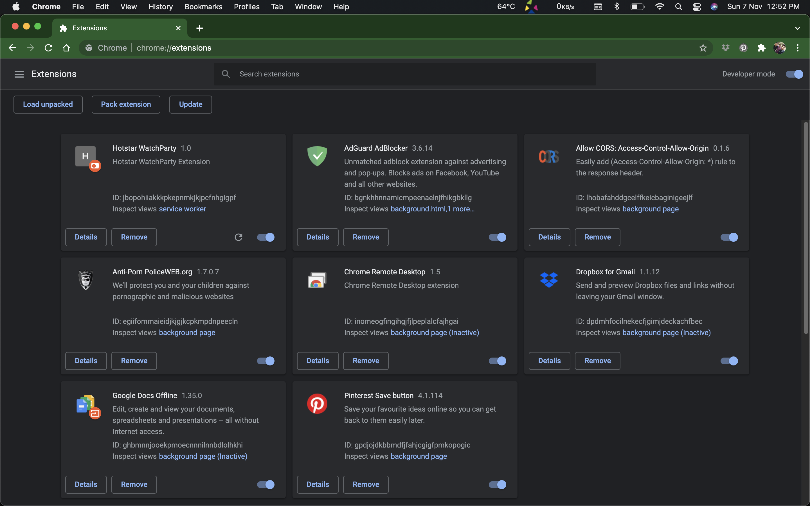
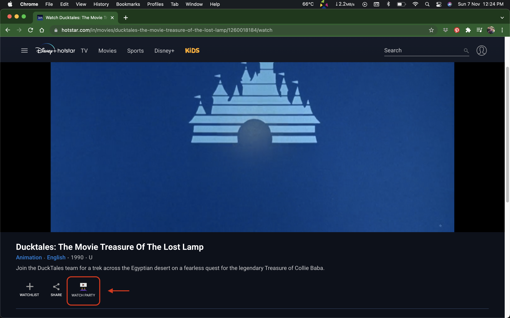
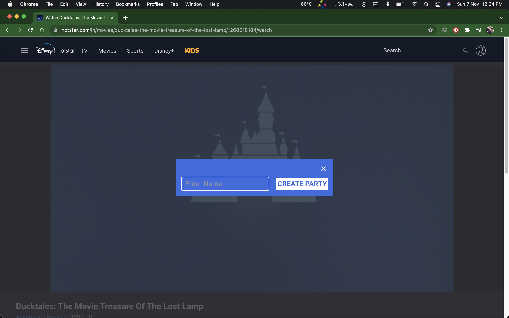
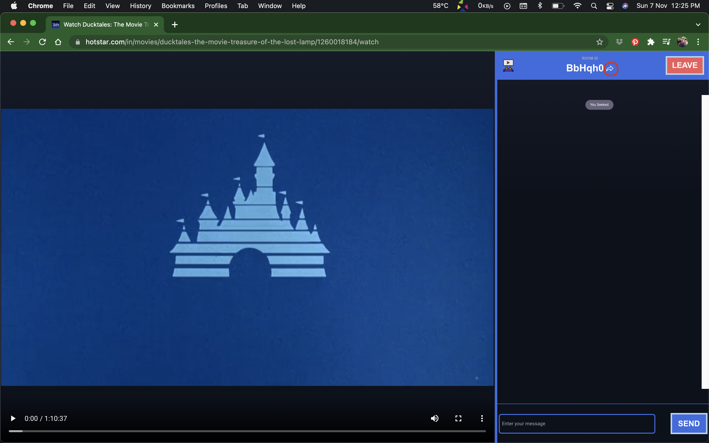
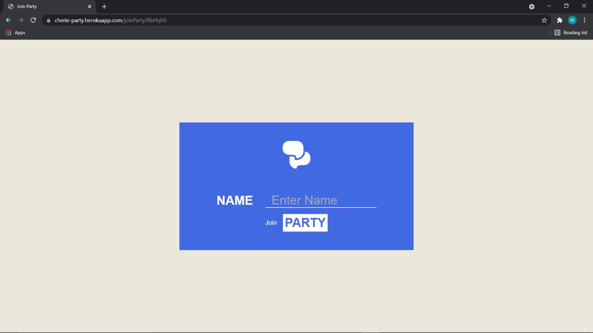
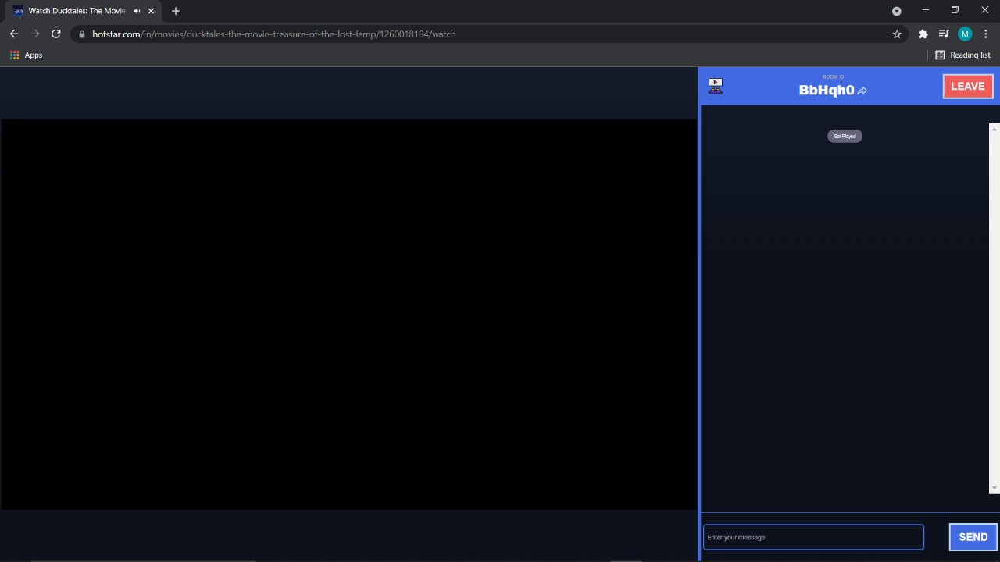

# Hotstar Watch Party Chrome Extension

Watch Party is a feature that allowed people to connect and watch people who are at distant places.

My motivation for taking up this project is primarily for job interviews, and secondarily, we need a hotstar watch party as the content here is awesome.

This is a hobby project and at the current stage this is merely a Proof of Concept(POC) than an MVP.

This feature can only be used by people who have a valid hotstar account. There is no piracy involved in this. This extension will only manipulate the page view and adds chatting and video control functionalities via a chat server I've implemented. I hope i'm not exploiting any hotstar's resources. I've only done this project to display my skills for my interviews and I request to please bring to my notice if i'm violating any policies of hotstar or any other company.

<h2>Steps</h2>

<h3>Install the Extension</h3>
1) Download the extension from <a href = "sprites/HotstarWatchPartyChromeExtension.zip">here</a> and unzip. There is a folder named "hwp".
 
2) Open Extensions in Chrome.

 
3) Turn on Developer Options. A new Button named "Load Unpacked" will be displayed. Click the button and select the folder "hwp".

 
4) Now the extension will get installed.

 

<h2>Create Watch Party</h2>
Note: One can only create or join a party if they have a valid hotstar account to view that content.
 
 
1) Open the content you want to watch in Hotstar in Chrome. There will be a "Watch Party" icon in the page. Click on that icon.

 
2) A popup will appear. Give Name and click on "Create Party" button to create a Watch Party.

 
3) Now the watch Party got created. Click on the share icon at the top of chat screen. The join party link will be copied to your clipboard. Simply paste the link and share.

 
<h2>Join Party</h2>
Note: Installation of extension is required for both creating and joining a watch party.
 
1) Enter the Join Party link in a new tab in chrome.

 
2) Enter Name and click on "PARTY" button and you'll join into the party in few secs.

 

Only Party Host can control the video.

Since the project is still in POC stage, there are many looseends and usability issues. Kindly contact me via MailTo:kumararduino@gmail.com for any queries or issues.

